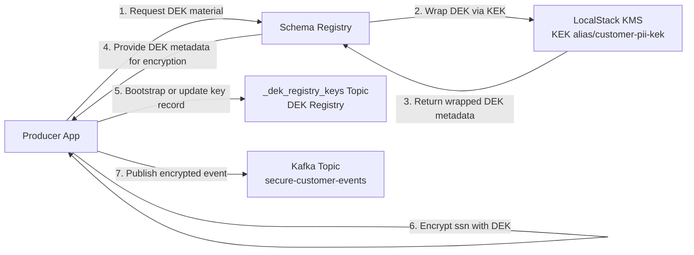
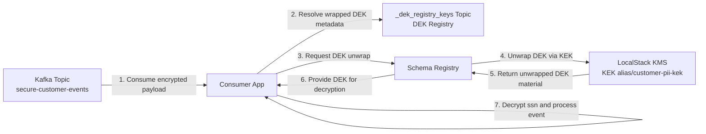

# <span style="color: #C0392B">Runbook</span>

## <span style="color: #27AE60">Purpose</span>
This runbook documents day-to-day operations for the local event pipeline stack:
- MinIO inbox and sink buckets
- Event generator
- Producer ingestion and Kafka publish
- Consumer processing
- LocalStack KMS alias and DEK bootstrap topic
- Kafka UI and Schema Registry checks

All commands assume execution from project root:

```bash
cd /Users/pchen/mygithub/Confluent-Envelop-Encryption-With-Spring
```

## <span style="color: #E67E22">Key Endpoints</span>
- Producer API: `http://localhost:8080/api/events`
- Schema Registry: `http://localhost:8081`
- Kafka Connect: `http://localhost:8083`
- Kafka UI: `http://localhost:8085`
- MinIO API: `http://localhost:9000`
- MinIO Console: `http://localhost:9001`
- LocalStack: `http://localhost:4566`

## <span style="color: #3498DB">1. Start and Stop</span>

### <span style="color: #8E44AD">Start full stack</span>
```bash
docker compose -f docker/docker-compose.yml up -d --build
```

### <span style="color: #1ABC9C">Check service status</span>
```bash
docker compose -f docker/docker-compose.yml ps
```

### <span style="color: #E74C3C">Stop without deleting volumes</span>
```bash
docker compose -f docker/docker-compose.yml down
```

### <span style="color: #F1C40F">Clean reboot (delete containers, network, volumes)</span>
```bash
docker compose -f docker/docker-compose.yml down -v
docker compose -f docker/docker-compose.yml up -d --build
```

## <span style="color: #884EA0">2. Health Verification</span>

### <span style="color: #2ECC71">Application and platform health</span>
```bash
curl -s http://localhost:8080/actuator/health
curl -s http://localhost:8085/actuator/health
curl -s http://localhost:8083/connectors
```

Expected:
- Producer health is `UP`
- Kafka UI health is `UP`
- Kafka Connect responds (empty list is valid if no connectors)

### <span style="color: #D35400">Core service logs</span>
```bash
docker compose -f docker/docker-compose.yml logs producer --tail=80
docker compose -f docker/docker-compose.yml logs consumer --tail=80
docker compose -f docker/docker-compose.yml logs event-generator --tail=80
```

## <span style="color: #1E8BC3">3. KMS and KEK Operations</span>

### <span style="color: #C0392B">Verify KMS alias exists</span>
```bash
docker compose -f docker/docker-compose.yml exec -T localstack awslocal kms list-aliases
```

Expected alias:
- `alias/customer-pii-kek`

### <span style="color: #9B59B6">Create alias if missing</span>
```bash
docker compose -f docker/docker-compose.yml exec -T localstack sh -lc '
KEY_ID=$(awslocal kms create-key --description "customer pii kek" --query "KeyMetadata.KeyId" --output text)
awslocal kms create-alias --alias-name alias/customer-pii-kek --target-key-id "$KEY_ID"
echo "ALIAS_CREATED_FOR=$KEY_ID"
'
```

## <span style="color: #E74C3C">4. Kafka and Schema Operations</span>

### <span style="color: #1ABC9C">Verify required topics</span>
```bash
docker compose -f docker/docker-compose.yml exec -T kafka kafka-topics --bootstrap-server kafka:29092 --list
```

Expected topics include:
- `secure-customer-events`
- `_schemas`
- `_dek_registry_keys`

### <span style="color: #F1C40F">Verify DEK registry topic offset</span>
```bash
docker compose -f docker/docker-compose.yml exec -T kafka kafka-get-offsets --bootstrap-server kafka:29092 --topic _dek_registry_keys
```

### <span style="color: #3498DB">Verify schema registration</span>
```bash
curl -s http://localhost:8081/subjects
curl -s http://localhost:8081/subjects/secure-customer-events-value/versions/latest
```

## <span style="color: #27AE60">5. Data Flow Validation</span>

### <span style="color: #E67E22">Confirm event generator writes to MinIO inbox</span>
```bash
docker compose -f docker/docker-compose.yml logs event-generator --tail=40
```

Expected log pattern:
- `Generated event ... -> minio://event-inbox/pending/...`

### <span style="color: #884EA0">Confirm producer ingests pending files and publishes to Kafka</span>
```bash
docker compose -f docker/docker-compose.yml logs producer --tail=80
```

Expected log pattern:
- `Spark micro-batch: ingested pending/... -> Kafka`

### <span style="color: #D35400">Confirm consumer receives and processes events</span>
```bash
docker compose -f docker/docker-compose.yml logs consumer --tail=80
```

Expected log pattern:
- `Consumed decrypted event: ...`

## <span style="color: #3498DB">6. Encryption Validation</span>

### <span style="color: #2ECC71">Validate latest message contains encrypted `ssn`</span>
```bash
docker compose -f docker/docker-compose.yml exec -T kafka sh -lc "
kafka-console-consumer --bootstrap-server kafka:29092 --topic secure-customer-events --partition 0 --offset latest --max-messages 1 --property print.value=true --timeout-ms 20000 > /tmp/latest.bin 2>/tmp/latest.err || true
grep -aoE '[0-9]{3}-[0-9]{2}-[0-9]{4}|enc:v1:[A-Za-z0-9+/=]+:[A-Za-z0-9+/=]+' /tmp/latest.bin || true
cat /tmp/latest.err | tail -n 5
"
```

Expected for new messages:
- `enc:v1:...` present
- plaintext SSN pattern absent

Note:
- Older historical messages may still contain plaintext if produced before encryption was enabled.

## <span style="color: #E74C3C">7. Manual Publish Test (HTTP)</span>

```bash
curl -X POST http://localhost:8080/api/events \
	-H 'Content-Type: application/json' \
	-d '{
		"eventId": "evt-manual-1001",
		"customerId": "cust-77",
		"fullName": "Ada Lovelace",
		"ssn": "123-45-6789",
		"action": "ACCOUNT_OPENED"
	}'
```

Expected response:
- `{"status":"queued",...}`

## <span style="color: #9B59B6">8. MinIO Validation</span>

### <span style="color: #1ABC9C">Verify consumer sink bucket objects</span>
```bash
docker exec minio sh -lc 'ls -R /data/secure-customer-events'
```

### <span style="color: #F1C40F">Verify inbox processing folders</span>
```bash
docker exec minio sh -lc 'ls -R /data/event-inbox'
```

Expected:
- `pending/` should stay near-empty under normal operation
- `processed/` should accumulate ingested files

## <span style="color: #1E8BC3">9. Kafka UI Operations</span>

Open:
- `http://localhost:8085`

Checks:
- Cluster `local` is online
- Topic `secure-customer-events` receives messages
- Internal topic `_dek_registry_keys` visible when showing internal topics
- Consumer group `secure-consumer-group` present

## <span style="color: #E67E22">10. Common Incidents and Recovery</span>

### <span style="color: #E74C3C">Consumer not running</span>
```bash
docker compose -f docker/docker-compose.yml logs consumer --tail=120
docker compose -f docker/docker-compose.yml up -d --build consumer
```

### <span style="color: #9B59B6">Producer not publishing</span>
```bash
docker compose -f docker/docker-compose.yml logs producer --tail=120
docker compose -f docker/docker-compose.yml up -d --build producer
```

### <span style="color: #1ABC9C">KMS alias missing after reboot</span>
Run the alias creation command in section 3, then restart producer and consumer:
```bash
docker compose -f docker/docker-compose.yml up -d --build producer consumer
```

### <span style="color: #F1C40F">Stuck pipeline or old state contamination</span>
```bash
docker compose -f docker/docker-compose.yml down -v
docker compose -f docker/docker-compose.yml up -d --build
```

## <span style="color: #3498DB">11. Quick Smoke Checklist</span>
1. `docker compose ... ps` shows all required services up
2. `awslocal kms list-aliases` includes `alias/customer-pii-kek`
3. Topic list includes `_dek_registry_keys` and `secure-customer-events`
4. Producer logs show ingestion from `event-inbox/pending/`
5. Consumer logs show decrypted events
6. Latest Kafka payload check shows `enc:v1:...` marker

## <span style="color: #8E44AD">12. Producer Envelope Encryption Diagram</span>


## <span style="color: #1ABC9C">13. Consumer Envelope Decryption Diagram</span>

